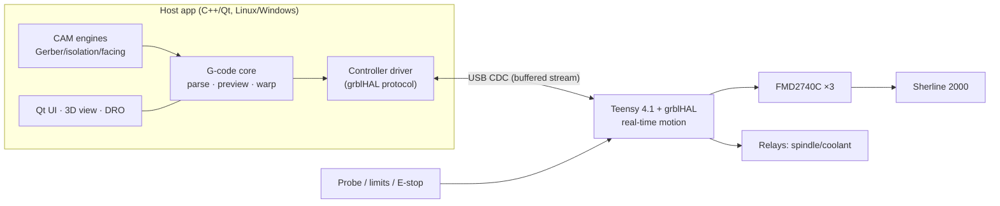

# SharkCNC — Project Plan

*A lightweight, Linux-first CNC control application for the Sherline 2000, with a
PCB-milling-first feature set. Working name `sharkcnc` (rename freely).*

---

## 1. Goals

- Replace PlanetCNC software with something that runs natively on Linux, on
  light-duty computers (old laptops, Raspberry Pi class).
- Robust USB link — a job must survive host hiccups, EMI, and OS scheduling.
- First-class probing: Z touch-off, corner finding, and grid height-mapping for
  PCB isolation milling on non-flat stock.
- Integrated CAM: Gerber/Excellon → isolation routing + drilling, and later
  simple ops like surface flattening/facing.
- Cross-platform capable: Linux first, Windows build achievable without a rewrite.
- Owner-maintainable: C++ codebase, open hardware files, no license servers.

## 2. Hardware assessment (from photos, 2026-07-17)

| Item | Detail | Verdict |
|---|---|---|
| UCNCV4 controller | PlanetCNC Mk1-protocol clone. MCU under shielded "VB17" can, 8 MHz osc, 6N137 optos on step/dir (X/Y/Z/A), 3× SRD-05VDC 10 A relays, 12 V input bank, USB-B | **Retire.** Firmware is locked/proprietary; USB protocol undocumented and license-tied. Reverse-engineering it is a dead end vs. a ~$35 open controller. |
| FMD2740C drivers ×3 (X/Y/Z) | 12–50 V, 0.5–4.0 A, Half…1/128 (+1/10, 1/20) microstep, opto-isolated SP/DIR/EN differential inputs, idle-current reduce | **Keep.** Standard step/dir — works with any controller. |
| Steppers | Long-body NEMA 23 on Sherline leadscrews | **Keep.** Set driver current to motor rating (≤4 A). |
| PSU | Enclosed fan-cooled switching supply | **Keep** for motor power. Add a separate small 5 V logic supply (isolation, see §8). |
| Sherline 2000 | Multi-direction column mill, 20 TPI leadscrews (0.050"/rev = 1.27 mm/rev), manual KB-style spindle speed box | Spindle: relay on/off first; optional speed-control mod later (§10). |
| Enclosure/wiring | MDF box, twisted-pair signal runs already in place | **Keep.** New controller drops into the UCNCV4's spot. |

**Step-rate math** (validates controller choice): 200 steps/rev × 1/8 µstep =
1600 steps/rev → **1259.8 steps/mm**. At a Sherline-realistic 750 mm/min rapid
that's ~15.7 kHz; even 1/16 µstep is ~31 kHz. The controller below does >150 kHz,
so there is huge headroom — run 1/8 or 1/16 for the best torque/smoothness balance.

## 3. Core architectural decision: split real-time from UI

USB is not real-time. Any design where the PC generates step timing over USB
(what PlanetCNC's board avoids by owning motion, and what parallel-port LinuxCNC
requires an RT kernel for) is fragile on a light-duty machine. So:

- **Motion controller (firmware)** owns all hard-real-time work: step pulse
  generation, acceleration planning, limits, probing latch. It buffers ~1 s of
  planned motion, so USB latency spikes never stall the tool mid-cut.
- **Host app (our C++ software)** owns everything else: G-code handling, UI,
  probing workflows, height-map warping, CAM. It streams G-code ahead of
  execution and never touches step timing.



### Firmware: grblHAL on Teensy 4.1 — use, don't rewrite

[grblHAL](https://github.com/grblHAL) is the mature open-source descendant of
Grbl: full G-code motion core with lookahead planning, homing, `G38.x` probing,
spindle/coolant control, and a Teensy 4.1 (600 MHz, native 480 Mbps USB) port
that sustains 150 kHz+ step rates. Writing our own firmware would cost months
before first movement and reproduce a solved problem. Instead:

- `firmware/` holds a pinned grblHAL build (submodule + our board map/config).
- The host talks to it through an abstract `MachineController` interface, so a
  future custom firmware (or another protocol) is a new driver, not a rewrite.

### Interface board: buy or build

**Buy option (recommended, researched 2026-07):** Brookwood Design **T41U5XBB**
grblHAL breakout for Teensy 4.1 — US$33.99 board-only / $47.99 with through-hole
assembly kit (SMD pre-soldered, you solder the through-hole parts). 10
opto-isolated inputs (limits, probe, control), 7 relay-capable outputs. Order
from brookwood-design-77.myshopify.com (their Tindie fulfillment is paused);
Teensy 4.1 itself from DigiKey Canada. This replaces the custom-carrier design
work in M2 entirely.

**Build option:** a small KiCad-designed carrier board (in `hardware/`) that you
etch or fab and populate — same role, replaces the UCNCV4 one-for-one:

- Teensy 4.1 socket.
- Buffered step/dir/enable outputs to the three FMD2740C driver pairs (their
  opto inputs give isolation on that side already; drive them differentially).
- Opto/RC-filtered inputs: 3× limit, probe (tool + PCB probe plate), E-stop,
  door/feed-hold.
- 2–3 relay or MOSFET outputs (spindle on/off, coolant/vacuum, aux) — replacing
  the UCNCV4's relays.
- Screw terminals matching the existing enclosure wiring; USB with proper
  grounding provisions (§8).

**Bring-up shortcut (M0):** wire a bare Teensy 4.1 to the drivers on protoboard
first and validate with an existing grbl sender (ioSender/Candle). The mill is
running again within days, hardware risk is retired early, and our app then
develops against known-good hardware.

## 4. Tech stack (host app)

| Layer | Choice | Why |
|---|---|---|
| Language | **C++20** | Your comfort zone; native performance on weak hardware; clean Windows path. |
| Build | **CMake + Ninja**, presets | Cross-platform standard; IDE-agnostic. |
| Deps | **vcpkg** (manifest mode) | Reproducible on Linux + Windows CI. |
| UI | **Qt 6 Widgets** | Native, light (no Electron/GC runtime), first-class serial + OpenGL, proven on Pi-class hardware. Widgets over QML for lower overhead and simpler tooling. |
| 3D preview | OpenGL 3.3 core via `QOpenGLWidget` | Runs on integrated/old GPUs. |
| Geometry (CAM) | **Clipper2** | Robust polygon boolean/offsetting — the heart of isolation routing and pocketing. |
| Serial | `QSerialPort` (UI-independent wrapper in core) | Portable USB CDC. |
| Tests | **Catch2** + CTest | Header-friendly, good CMake integration. |
| Format/lint | clang-format, clang-tidy | Enforced in CI. |

**Two-library split, strictly enforced:** `core/` (parser, machine drivers,
height map, CAM) has **zero Qt dependency** — it's a plain C++ library with a
thin CLI (`tools/`). All of it unit-tests headlessly in CI. `app/` is the Qt
shell. This is also what makes a future Windows service/CLI or alternate UI cheap.

## 5. Repository layout & GitHub

```
sharkcnc/
├── core/                  # libsharkcnc — no Qt
│   ├── gcode/             # parser, modal state, program model
│   ├── machine/           # MachineController iface, grblHAL driver, simulator
│   ├── transport/         # serial abstraction + mock/loopback
│   ├── heightmap/         # probe grids, bilinear interp, Z-warping
│   └── cam/               # CamOperation iface: isolation, drill, facing…
├── app/                   # Qt 6 application
├── tools/                 # CLI: gcode-check, cam batch, protocol sniffer
├── firmware/              # grblHAL submodule + Teensy 4.1 board map/config
├── hardware/              # KiCad: carrier board, BOM, enclosure notes
├── tests/                 # Catch2 suites, golden files, recorded transcripts
├── docs/                  # setup, wiring, probing/PCB workflow guides
└── .github/workflows/
```

Practices: `main` protected, short-lived feature branches, PRs with CI green
required (even solo — it keeps history bisectable), Conventional Commits,
tagged releases with binaries, GitHub Issues + a milestone per section-7 phase.
License: MIT or GPLv3 — decide before first push (grblHAL is GPLv3; it lives in
its own repo as a submodule so the host app's license is independent).

## 6. CI (GitHub Actions)

| Workflow | Trigger | Jobs |
|---|---|---|
| `build-test` | push/PR | Linux (gcc + clang) and Windows (MSVC) matrix: configure, build, run core unit tests; Qt app built with `-platform offscreen` smoke test. vcpkg + Qt cached. |
| `quality` | PR | clang-format gate; clang-tidy; ASan/UBSan test run of `core/`. |
| `firmware` | changes in `firmware/` | Build grblHAL Teensy 4.1 image (PlatformIO/arduino-cli); artifact the `.hex`. |
| `hardware` | changes in `hardware/` | KiBot: ERC/DRC, render PDFs/gerbers as artifacts. |
| `sim-integration` | PR | Drive the grblHAL driver against the machine **simulator** — full job streaming, probing sequences, error injection (dropped bytes, disconnects) with no hardware. |
| `release` | tag `v*` | Linux AppImage + Windows zip/NSIS installer, attach to GitHub Release. |

The simulator is the linchpin: every protocol/streaming feature is testable in
CI, and the app is developable away from the shop.

## 7. Roadmap

- **M0 — Hardware bring-up (no new code).** Parts-bin first (2026-07: T41U5XBB
  out of stock): RAMPS 1.4 + grbl-Mega-5X for immediate motion, and/or ESP32 +
  FluidNC (needs 5V buffer, e.g. 74HCT244/ULN2803) as the interim keeper.
  Teensy 4.1 + grblHAL on protoboard when parts arrive,
  configured for the machine (1259.8 steps/mm @ 1/8 µstep, accel/rapids tuned,
  homing off existing or added limit switches). Validate with ioSender/Candle.
  *Exit: mill cuts a test part under grblHAL.*
- **M1 — Repo, CI, core, minimal UI.** *(DONE 2026-07-19: core lib, driver+simulator, Qt app w/ jog/DRO/console/run/preview, CI. Bonus: M3 probing engine + M4 gerber CAM first slices shipped early.)* Layout above; G-code parser + program
  model; transport + grblHAL driver + simulator; Qt app: connect, DRO, jog
  (keyboard + on-screen), homing, zeroing, load/preview/run/hold/resume/abort,
  console. *Exit: full job run from our app; sim-integration CI green.*
- **M2 — Interface board.** T41U5XBB (buy) or KiCad carrier board (build, §3);
  migrate enclosure off the UCNCV4. E-stop + limits wired properly. *Exit:
  UCNCV4 in the drawer of retired boards.*
- **M3 — Probing & PCB milling workflow.** G38.2 UI with guarded motion;
  Z touch-off (plate w/ thickness offset); corner/edge finding; **grid height
  map** over board area → bilinear-interpolated Z-warping applied at stream
  time; save/load maps. *Exit: clean isolation mill of a known-warped FR4 blank
  from third-party G-code (e.g. pcb2gcode output).*
- **M4 — Gerber CAM.** RS-274X + Excellon parsers; aperture flash/stroke →
  polygons; Clipper2 union + offset → isolation passes (1..n offsets); drill
  cycles + optional peck; board outline cut with tabs; per-op tool/feed/speed
  library; toolpath preview overlaid on copper. *Exit: Gerber in → probed →
  milled PCB, entirely inside SharkCNC.*
- **M5 — General CAM foundation + flattening.** Promote a `CamOperation`
  plugin-style interface (params → toolpaths → G-code); first op: raster/spiral
  **surface facing** with stepover/depth control (doubles as spoilboard
  flattening). Future ops (2.5D pocket, drilling from DXF, engraving) slot in.
- **M6 — Windows build & release polish.** CI already builds it; this is
  packaging, serial-port quirks, installer, docs. Plus quality-of-life:
  job-recovery after disconnect, tool-change prompts, backlash compensation
  evaluation (grblHAL option vs. host-side).

### Delivered ahead of schedule (2026-07-19)

- **Tool library**: `core/cam/tool.*` — type-aware tool model with
  `widthAtDepth` (V-bit/chamfer isolation width from cut depth, ball-nose
  sphere, flat constant), JSON persistence, editor dialog, CAM isolation
  tool-picker deriving width/feed/speed from the chosen tool.
- **Facing / flattening** (M5): `core/cam/facing.*` — raster/spiral area
  clearing, multi-pass; CLI `sharkcam face` + CAM "Face" tab.
- **Board outline with tabs** (M4): `core/cam/outline.*` — offset cut,
  multi-pass, N holding tabs; CLI `sharkcam outline` + CAM "Outline" tab.
  Copper + drill + face + outline now cover a whole board.
- **Tool-change prompts**: host-managed M0/M6 handling — the sender drains
  motion, prompts with the tool message, resumes on click (multi-tool
  drill jobs guide the operator through each change).
- **3D view + STL import**: OpenGL 3.3 view (orbit/pan/zoom, ortho↔persp
  toggle, Top/Front/Iso), STL stock/part rendering. 2D stays the PCB
  default. Next 3D items: STEP import (OpenCASCADE, gated) and voxel cut
  simulation.
- **Job recovery**: `core/gcode/resume.*` — mid-job disconnect stashes the
  cursor; reconnect offers a modal-state-preserving, safe-Z resume.
- **UX**: unified dark theme, per-axis DRO with inline zeroing, colour-coded
  jog with held-key continuous jog, drag-and-drop file loading.

### 3D view & cut simulation (future — M5+, explicitly deferred)

The current preview is 2D (`QPainter`), which is correct for PCB/flat CAM
and stays the default. 3D CAD import and a Blender-style camera are a
separate, larger effort, sequenced so nothing half-built ships:

- **3D toolpath view:** move rendering to `QOpenGLWidget`, draw the same
  cached path geometry with a Z axis, add an arcball camera with an
  **orthographic ↔ perspective** toggle. Medium effort; no new deps.
- **3D model import:** STL first (trivial mesh loader) to place/verify stock
  and fixtures; STEP later via OpenCASCADE (heavy dependency — gate behind a
  build option). This is what "load in 3D CAD" needs.
- **Material-removal (cut) simulation:** voxel or dexel field the toolpath
  carves, using the tool-library geometry, to catch gouges/crashes before
  cutting. Later still: time-accurate playback showing real feeds/speeds.
  Depends on the tool library (done) and the 3D view.

Rationale for deferring: the 2D view + tool library + probing + CAM deliver
a complete PCB workflow now; 3D is essential for general 2.5D/3D CAD milling
but adds a rendering stack and (for STEP) a big dependency that shouldn't
block the board bring-up.

Sequencing rationale: M0 de-risks hardware before any code exists; M1–M2 make
the machine daily-usable (existing senders as fallback throughout); M3–M4
deliver the differentiating PCB workflow; M5 generalizes CAM.

## 8. USB robustness (a checklist, not a hope)

Dropped USB on hobby CNC is almost always EMI + an unbuffered protocol. Attack
both:

**Electrical**
- Motion buffered in firmware (§3) — a 100 ms host stall changes nothing mid-cut.
- Separate 5 V logic supply; single-point ground; logic ground never shares a
  return path with motor current.
- Keep the FMD2740C opto barrier intact (no shared grounds around it); shielded
  USB cable, shield grounded at PC end only; ferrites on USB and motor leads;
  motor wiring (already twisted) routed away from signal runs.
- RC + opto filtering on probe/limit inputs (spindle brush noise is the classic
  false-trigger source).

**Software**
- Character-counting streaming (fill the controller's RX buffer, never block on
  line ACK round-trips); status polling at ~5 Hz.
- Supervised connection: heartbeat, auto-reconnect, and a persisted job cursor →
  "controller reset at line N — re-home and resume?" flow.
- Error-injection tests in CI (§6): dropped bytes, torn lines, mid-job
  disconnect must produce a safe stop + recoverable state, never a hang.
- Firmware watchdog (grblHAL) → alarm state on comms loss, spindle relay drops.

## 9. Performance & optimization

Targets: cold start < 2 s; idle RAM < 100 MB; smooth on a Pi 4 / 2012 laptop
with integrated graphics; open + preview a 1 M-line G-code file < 3 s.

- Parse/preview off the UI thread; single-pass parser, arena/pooled allocation,
  no per-line heap churn.
- Preview geometry in chunked static VBOs; level-of-detail decimation for arc
  soup; redraw only on change (no free-running render loop); DRO updates
  batched to the status-poll rate.
- CAM ops run on a worker pool with progress + cancel; Clipper2 on integer
  coordinates (fast + robust).
- CI perf smoke test: parse + plan a large reference file under a time budget,
  so regressions surface in PRs.
- No Electron, no JIT runtime, no bundled browser — this is most of the battle
  for light-duty machines.

## 10. Future feature runway (enabled, not built)

- **Spindle speed control:** Sherline's KB-style speed controller can be modded
  for external control; a small PWM→isolated 0–10 V daughterboard + grblHAL
  spindle PWM gets `S`-word control and true `M3 S8000`. Board has a reserved
  header for it.
- 4th axis: UCNCV4 wiring already anticipated an A axis; grblHAL supports it —
  a fourth FMD2740C + rotary table later.
- Backlash compensation, tool table w/ length offsets, DXF import for the CAM
  layer, voronoi-style isolation, autoleveling reuse for engraving on curved
  stock, pendant/MPG via a second USB HID.

## 11. Risks & mitigations

| Risk | Mitigation |
|---|---|
| Scope creep before the mill moves | M0 uses zero new code; existing senders stay as fallback until M3. |
| grblHAL limitation found late | All access via `MachineController`; custom firmware remains a drop-in option. |
| Gerber parsing edge cases (aperture macros are gnarly) | Golden-file corpus from KiCad/Eagle/JLC outputs in CI; pcb2gcode/FlatCAM as reference implementations; ship M3 (external G-code) before M4 depends on our parser. |
| EMI gremlins on the new board | §8 checklist designed-in from rev A; protoboard phase surfaces issues cheaply. |
| Solo-project bus factor / motivation | Small milestones with a usable machine after each; CI keeps quality without ceremony. |

## 12. Immediate next steps

1. Order: Teensy 4.1, protoboard/breakout, small 5 V PSU, USB cable w/ ferrites
   (~$50 total).
2. Check stepper nameplate current → set FMD2740C DIP switches (≤4 A, 1/8 µstep,
   idle reduce ON).
3. Flash grblHAL Teensy build; bench-test one axis before mounting in enclosure.
4. `gh repo create` with the §5 skeleton + `build-test` CI on day one.
5. Decide license + final project name.
